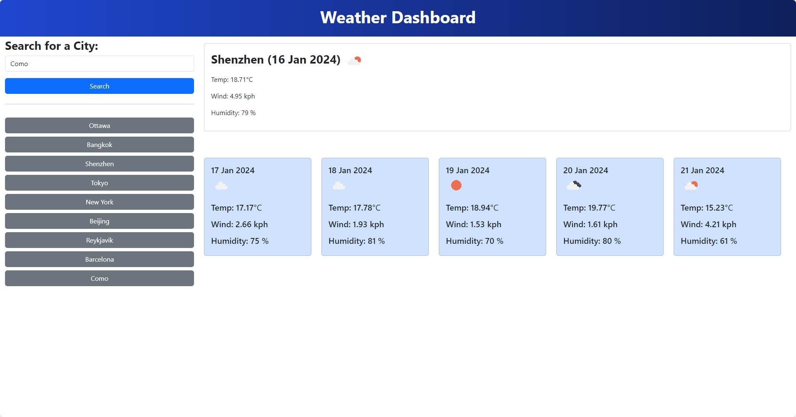

# Module Challenge – Weather Dashboard
## Description
This project is to create a weather dashboard that displays the current weather and five day forecast for a searched city. The searched cities will also be saved.

The most difficult part this time is to create a logical connection between functions. When I first completed writing the functions to get current weather and five day forecast data, I thought 80% of the challenge was done. It turned out I was wrong – it took me hours to connect them to local storage and click events after adding these two to the script. For example, using JSON stringify to store items as array, which cost me some time to decide if I should store them as object, array or separate key/value pairs.

With the help of jQuery and Bootstrap, I was able to focus more on building up the logic instead of worrying about the design. One important lesson I learned from this week’s mini-project is that I am a slow starter. When being put in group work, I couldn’t handle the time sensitive tasks at this point yet. After the class, at least I knew what can be done first in order to save time.

Link to the live application:
https://leesoohang.github.io/module8-weather-dashboard

Link to the repository:
https://github.com/leesoohang/module8-weather-dashboard.git

## Installation
N/A

## Usage
The weather dashboard application can be found in ‘index.html’ along with the script.

Screenshot:

## Credits
Day.js: 

https://dayjs.gitee.io/docs/en/get-set/get-set

Weather Dashboard by Alex Chigas - GitHub:

https://github.com/Achigas/Weather-Dashboard-Chal6

List Groups - Bootstrap:

https://getbootstrap.com/docs/5.3/components/list-group/#links-and-buttons

Input Group – Bootstrap:

https://getbootstrap.com/docs/5.3/forms/input-group/
